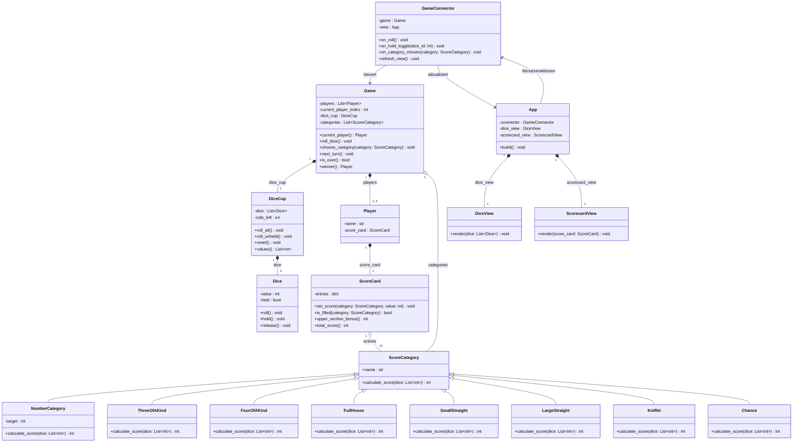

# Klassendiagramm

---

Das Diagramm zeigt die drei Schichten
`game/`, `connector/`, `gui/` und insbesondere die Vererbungshierarchie der
Bewertungskategorien

**Erklärung:**

- **Vererbung/Polymorphie:** Alle 13 Kniffel-Kategorien sind Unterklassen von
  `ScoreCategory` und überschreiben `calculate_score()`. Die sechs
  Zahlenkategorien (Einer…Sechser) werden dabei nicht als sechs Klassen
  dupliziert, sondern durch eine einzige `NumberCategory` mit Parameter
  `target` abgedeckt.
- **Zusammensetzung:** `Game` besteht aus `Player`n und einem `DiceCup`,
  `DiceCup` besteht aus 5 `Dice`. Diese Objekte existieren nicht unabhängig
  vom übergeordneten Objekt.
- **Schichtentrennung:** `game/`-Klassen haben keine Kenntnis von `App`,
  `DiceView` oder `ScorecardView`. Nur `GameConnector` kennt beide Seiten und
  vermittelt zwischen Spiellogik und Tkinter-Oberfläche.
